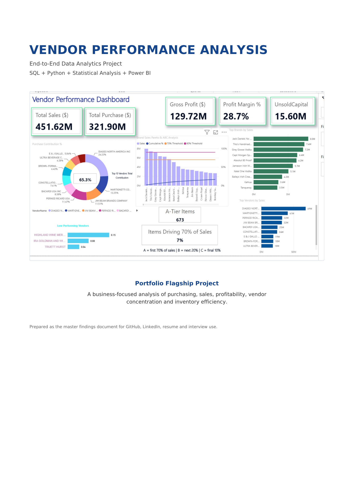
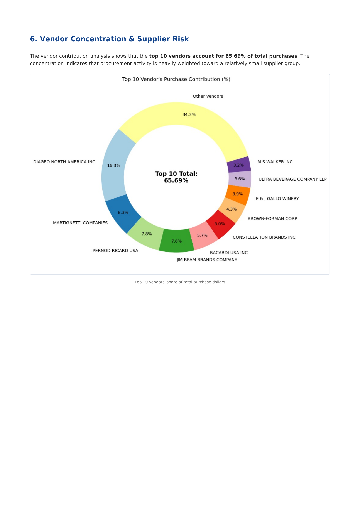
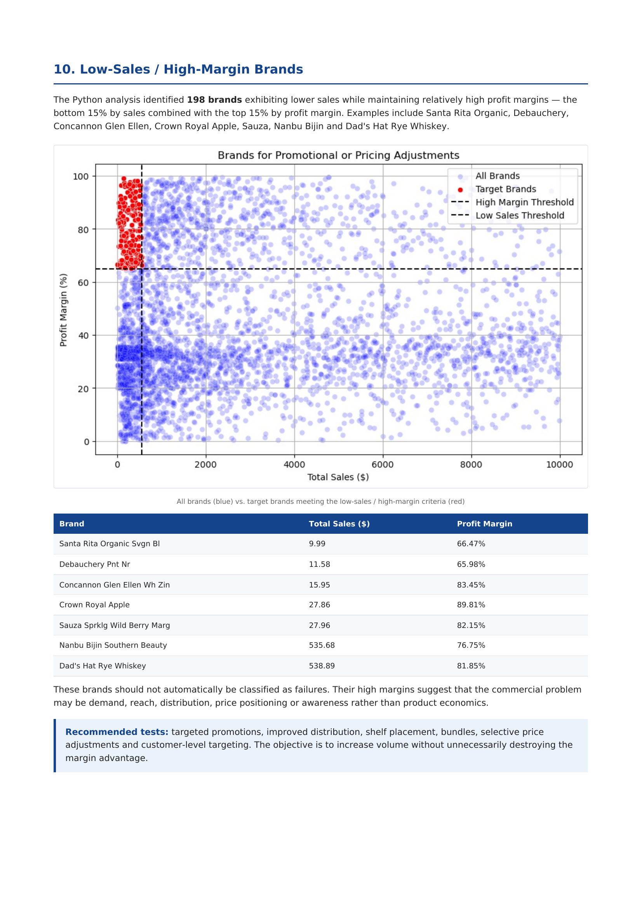
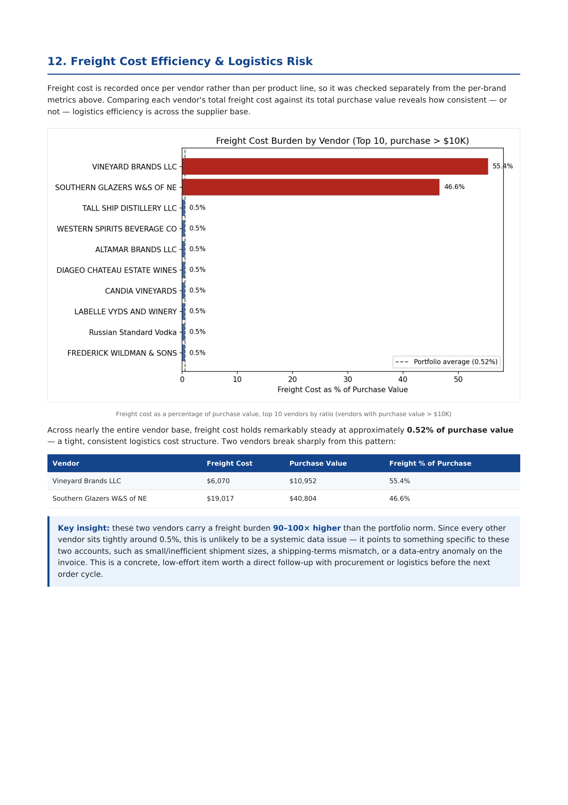
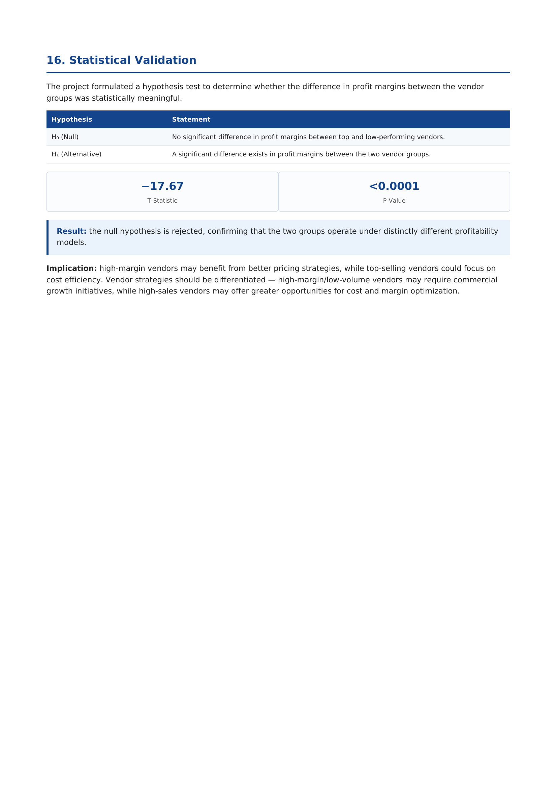
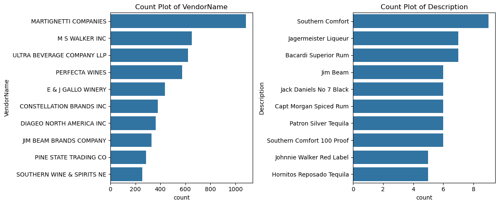

# 🥃 Vendor Performance Analysis
### End-to-End Data Analytics Project — SQL · Python · Statistical Analysis · Power BI


> A full analytics workflow — from raw transactional data to a statistically validated, executive-ready
> dashboard — built to answer a real procurement question: **where is this business winning, where is
> capital being wasted, and which decisions would actually move the numbers?**

---

## 📖 Contents

- [Overview](#-overview)
- [Business Questions](#-business-questions)
- [Tech Stack](#-tech-stack)
- [Workflow](#-workflow)
- [Headline Results](#-headline-results)
- [Key Insights](#-key-insights)
- [Dashboard Preview](#-dashboard-preview)
- [Repository Structure](#-repository-structure)
- [How to Reproduce](#-how-to-reproduce)
- [Skills Demonstrated](#-skills-demonstrated)
- [Full Findings Report](#-full-findings-report)
- [About Me](#-about-me)

---

## 📌 Overview

This project analyzes purchasing, sales, profitability, and inventory efficiency across a portfolio of
**128 vendors and 9,651 products**, using a dataset of **10,692 vendor–brand summary records**. It goes
beyond a standard sales dashboard to answer procurement-specific questions: which vendors carry
concentration risk, which products are quietly tying up capital, whether bulk purchasing actually pays off,
and whether the observed differences in vendor profitability are statistically real or just noise.

The workflow runs end to end: **SQL** for data extraction and joins → **Python** for cleaning, feature
engineering, and hypothesis testing → **Power BI** for an interactive, multi-page executive dashboard.

---

## 🎯 Business Questions

- Which vendors contribute the most to purchasing and sales — and how concentrated is that dependency?
- Which products drive the majority of sales, and which are quietly underperforming?
- Where is capital tied up in unsold inventory?
- Does bulk purchasing actually reduce unit cost, and by how much?
- Are high-margin products necessarily the best-performing products?
- Is the profit-margin gap between top and low-performing vendors statistically significant, or coincidence?
- What relationships exist between price, volume, turnover, and profitability?

---

## 🧰 Tech Stack

| Layer | Tools |
|---|---|
| Data storage & extraction | SQLite, SQL (CTEs, multi-table joins) |
| Data processing | Python, pandas, numpy |
| Statistical analysis | scipy.stats (confidence intervals, independent t-test) |
| Visualization (EDA) | matplotlib, seaborn |
| Dashboarding | Power BI, DAX |
| Reporting | Automated PDF findings report |

---

## 🔁 Workflow

```
Raw CSVs → SQLite ingestion → SQL CTE joins (purchases + sales + freight)
   → Python cleaning & feature engineering → Exploratory data analysis
   → Correlation & outlier analysis → Vendor/product segmentation (ABC, target-brand flagging)
   → Statistical validation (95% CI + t-test) → Power BI dashboard → Business recommendations
```

---

## 📊 Headline Results

| Metric | Value |
|---|---|
| Total Sales | **$451.62M** |
| Total Purchases | **$321.90M** |
| Gross Profit | **$129.72M** |
| Profit Margin | **28.7%** |
| Capital Tied Up in Unsold Inventory | **$15.60M** |
| Top 10 Vendor Purchase Concentration | **65.69%** |
| A-Tier Brands (Pareto) | **673 brands drive 70% of sales — just 7% of the catalog** |

---

## 🔑 Key Insights

- **Vendor concentration is real.** The top 10 of 128 vendors account for 65.69% of total purchasing —
  efficient, but a supplier-risk exposure worth managing deliberately.
- **7% of the catalog drives 70% of sales.** ABC/Pareto analysis identified 673 A-tier brands that deserve
  tighter replenishment and forecasting discipline than the long tail.
- **Bulk purchasing works — up to a 72% unit-cost reduction.** Average unit price falls from $39.07 (small
  orders) to $10.78 (large orders), though the analysis flags this as only worth pursuing where demand and
  turnover justify it.
- **Low-performing vendors aren't underperforming on margin — they're underperforming on reach.**
  Vendors with the lowest sales carry a *statistically significantly higher* mean profit margin (41.57% vs.
  31.18% for top vendors — independent t-test, T = -17.67, p < 0.0001). 198 specific low-sales/high-margin
  brands were flagged as promotion candidates rather than delisting candidates.
- **Catalog breadth and revenue concentration are two different playbooks.** Diageo North America generates
  **5.9× more revenue per SKU** than Martignetti Companies, the portfolio's broadest-catalog vendor (396 vs.
  1,388 line-items) — a distinction a simple "top vendor by sales" ranking completely hides.
- **A hidden freight-cost anomaly.** Freight cost holds steady at ~0.52% of purchase value across nearly the
  entire vendor base — except two vendors running 90–100× that rate, a concrete, low-effort follow-up for
  procurement.
- **$15.60M is tied up in unsold inventory**, concentrated among a specific, identifiable group of
  low-turnover vendors — a clear target for working-capital recovery.

---

## 📈 Dashboard Preview

**Full Power BI Dashboard**


**Vendor Concentration — Top 10 vendors drive 65.69% of purchases**


**Low-Sales / High-Margin Brand Detection — 198 brands flagged for promotion, not delisting**


**Freight Cost Anomaly — 2 vendors at 90–100× the portfolio norm**


**Statistical Validation — Top vs. low vendor margin gap (T = -17.67, p < 0.0001)**


**Portfolio Breadth vs. Concentration — Diageo generates 5.9× more revenue per SKU than Martignetti**



---

## 🗂️ Repository Structure

```
vendor-performance-analysis/
│
├── data/
│   └── vendor_sales_summary.csv          # cleaned, feature-engineered summary table
│
├── notebooks/
│   ├── Exploratory_Data_Analysis.ipynb   # SQL exploration, table relationships
│   └── Vendor_Performance_Analysis.ipynb # EDA, segmentation, statistical testing
│
├── scripts/
│   ├── ingestion_db.py                   # loads raw CSVs into SQLite
│   └── get_vendor_summary.py             # SQL CTE join + feature engineering pipeline
│
├── powerbi/
│   └── Vendor_Performance_Dashboard.pbix
│
├── images/                               # dashboard & chart exports used in this README
│
├── reports/
│   └── Vendor_Performance_Analysis_Detailed_Findings_Report.pdf
│
└── README.md
```

---

## ⚙️ How to Reproduce

```bash
# 1. Clone the repo
git clone https://github.com/hiten-shah-analytics/vendor-performance-analysis.git
cd vendor-performance-analysis

# 2. Install dependencies
pip install pandas numpy scipy matplotlib seaborn sqlalchemy

# 3. Load raw data into SQLite
python scripts/ingestion_db.py

# 4. Build the vendor summary table (SQL joins + cleaning + feature engineering)
python scripts/get_vendor_summary.py

# 5. Open the notebooks to explore the analysis
jupyter notebook notebooks/Vendor_Performance_Analysis.ipynb

# 6. Open powerbi/Vendor_Performance_Dashboard.pbix in Power BI Desktop for the interactive dashboard
```

---

## 🧠 Skills Demonstrated

| Area | Applied in this project |
|---|---|
| SQL | CTE-based multi-table joins across purchases, sales and freight; aggregation at the correct grain to avoid fan-out and double-counting |
| Python / pandas | Data cleaning, negative/zero-value handling, feature engineering (profit margin, stock turnover, HasSales flag), groupby-based segmentation |
| Statistics | 95% confidence intervals (t-distribution), independent-samples t-test to validate margin differences between vendor groups |
| Data visualization | Distribution analysis, correlation heatmaps, Pareto/ABC charts, scatter-based segmentation (matplotlib / seaborn) |
| Power BI / DAX | Weighted-average measures, percentile-based segmentation, multi-page interactive dashboarding |
| Business framing | ABC/Pareto analysis, vendor concentration risk, unsold-capital quantification, procurement-domain recommendations |

---

## 📄 Full Findings Report

The complete 23-page write-up — methodology, full statistical output, and business recommendations — is
available here: [`Vendor_Performance_Analysis_Detailed_Findings_Report.pdf`](reports/Vendor_Performance_Analysis_Detailed_Findings_Report.pdf)

---

## 🙋 About Me

I'm **Hiten Shah**, a Purchase Engineering Executive with 4+ years of procurement and supply chain
experience, transitioning into Data Analyst / Supply Chain Analyst roles. This project reflects that
background directly — the questions it answers are the same ones I ask in my day job, just backed here by
SQL, statistical testing, and an interactive dashboard instead of a spreadsheet.

- 🔗 LinkedIn: [linkedin.com/in/hiten-shah-analyst963](https://linkedin.com/in/hiten-shah-analyst963)
- 💻 GitHub: [github.com/hiten-shah-analytics](https://github.com/hiten-shah-analytics)

If you're hiring for Data Analyst or Supply Chain Analyst roles in Mumbai, I'd love to connect.
